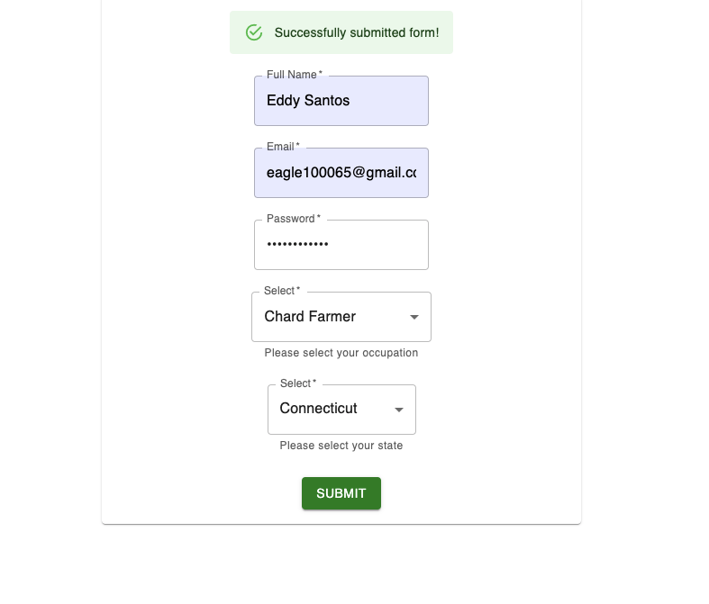

# SWE-Challenge-fetch

## To start this application

1. npm i
2. in your terminal - $npm run start
3. in another terminal - $npm run server
4. open your browser to localhost:3000

## Tech used -

 MUI

 React

 Webpack

